# ShopForHome


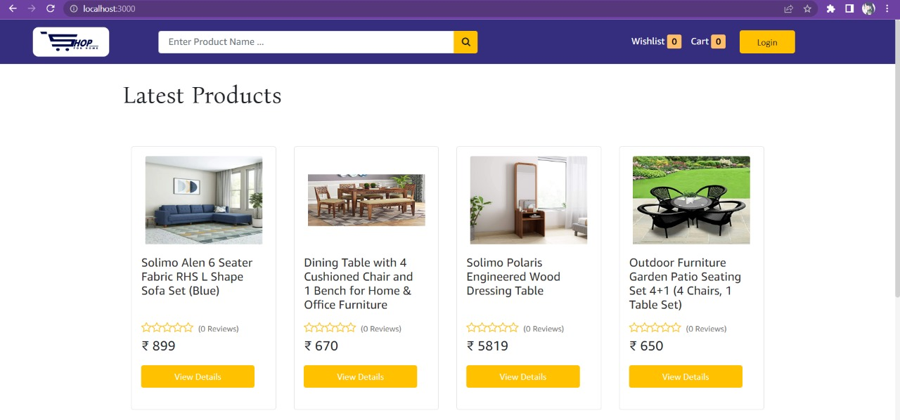


# Product details and admin user details

### To get the products and to login as a admin you need to upload the product.json file and users.json file in your mongodb 

Admin Login

```
{
    "email": "faisal@gmail.com",
    "password": "123456789"
}
```

User Login

```
{
    "email": "user@gmail.com",
    "password": "123456789"
}
```

(Stripe) Card Payment Details 

```
4242 4242 4242 4242
Any future Date
Any three digit
```
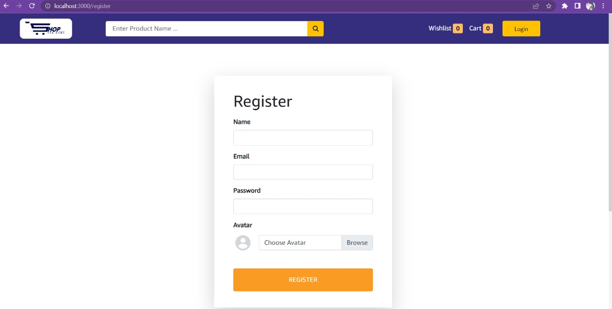
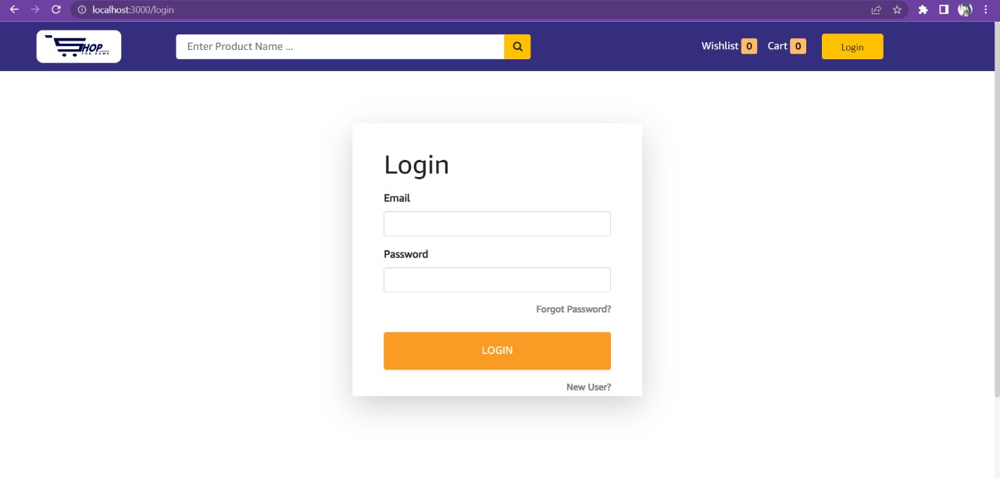
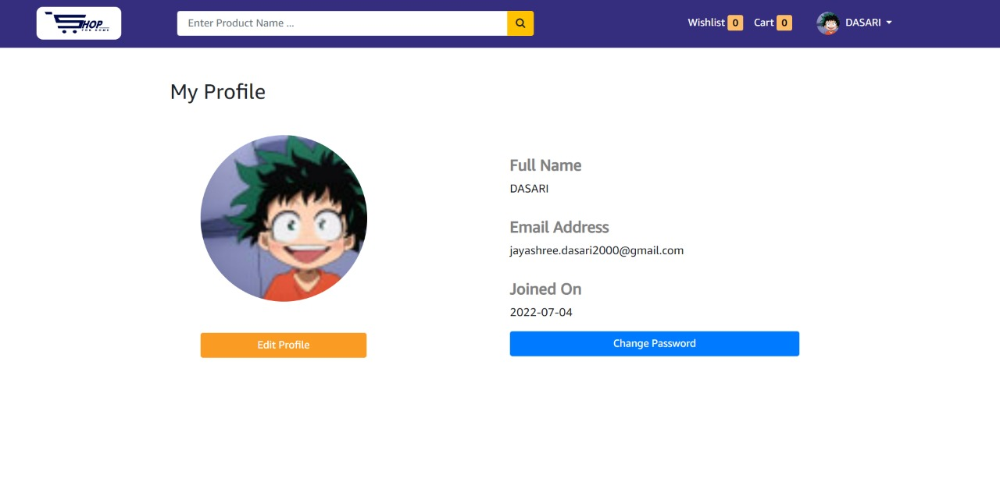
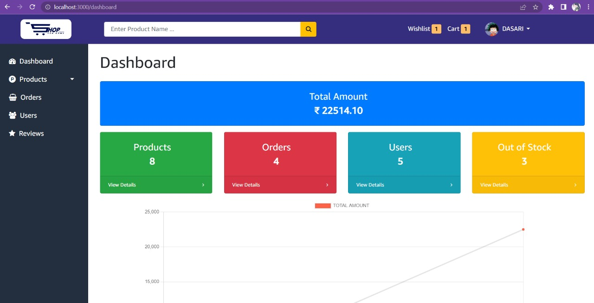
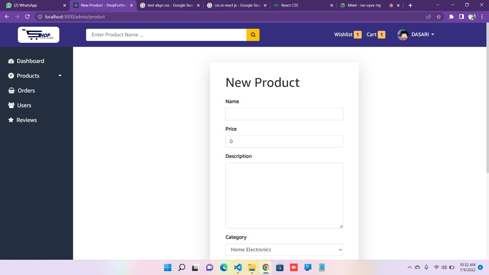

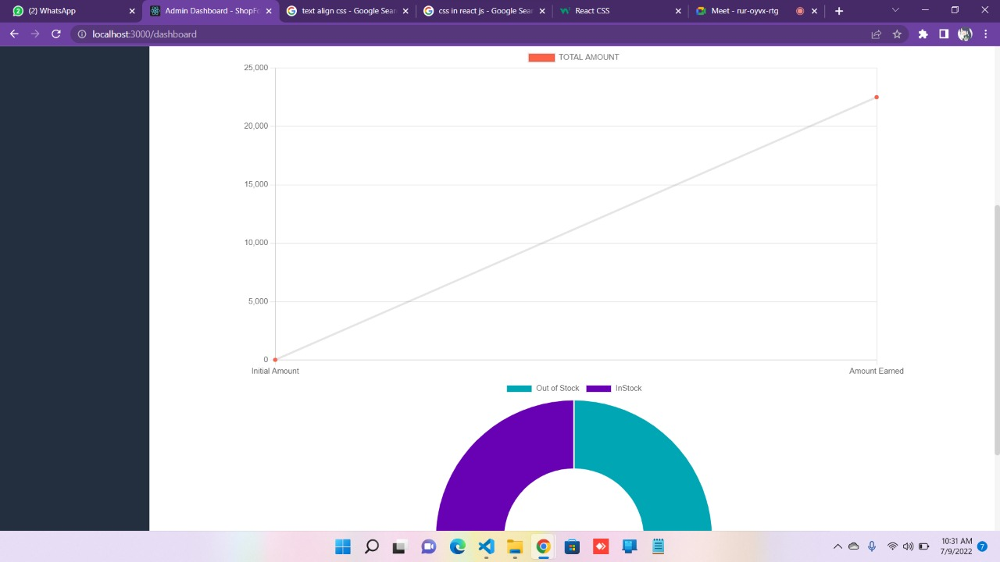
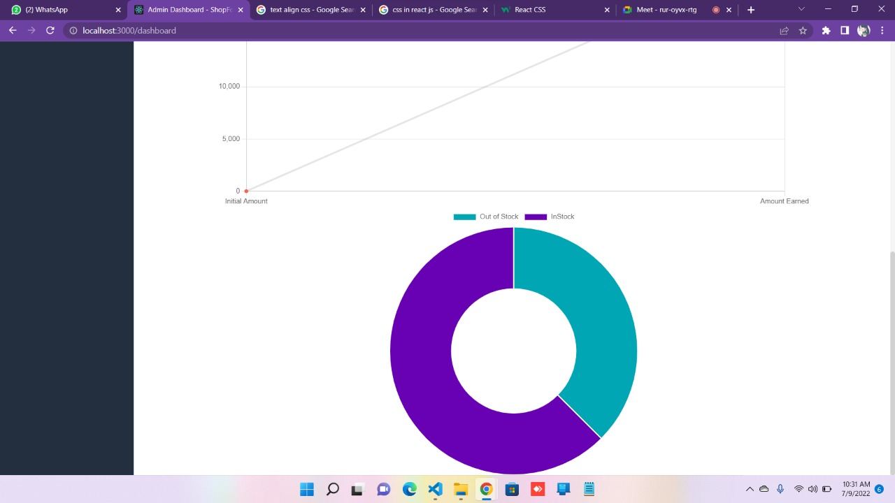
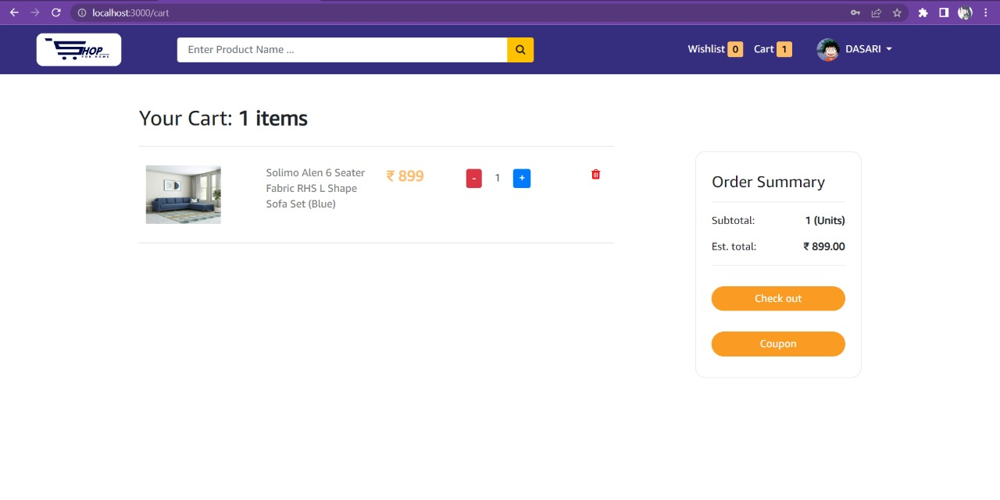
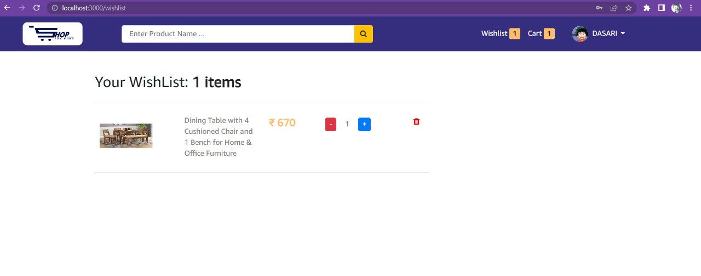
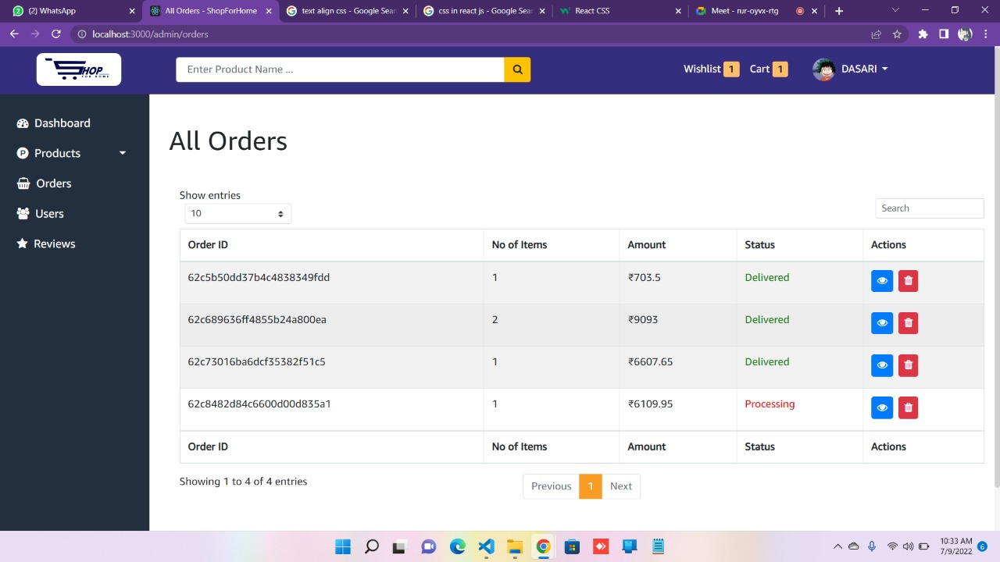
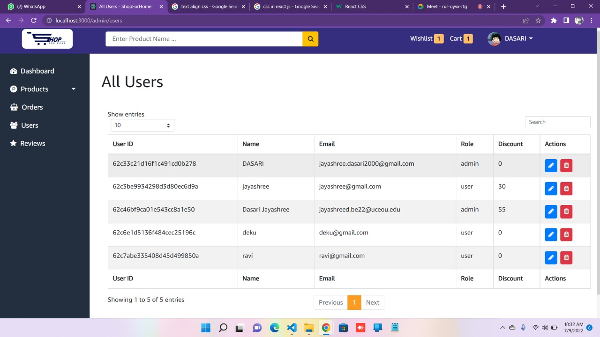
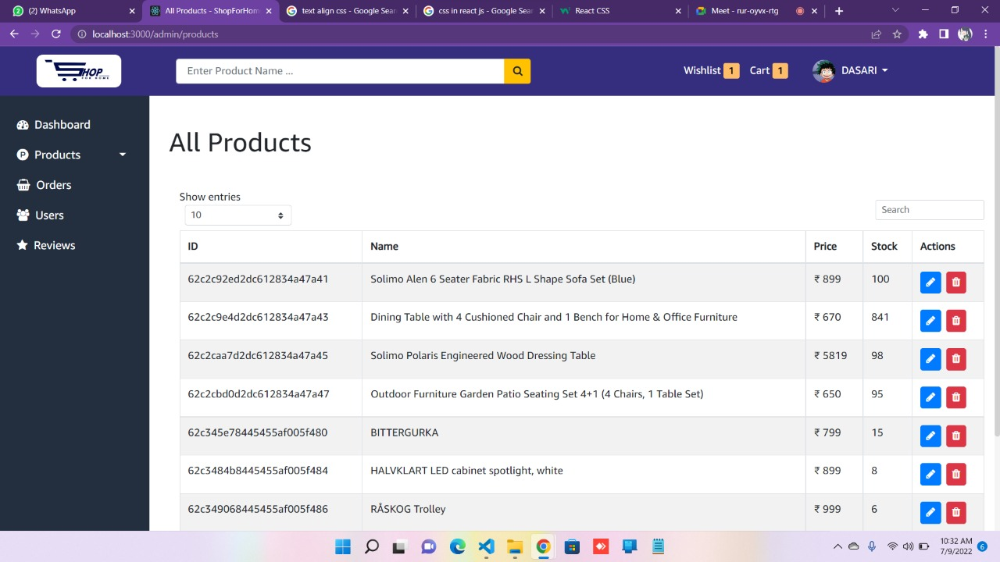
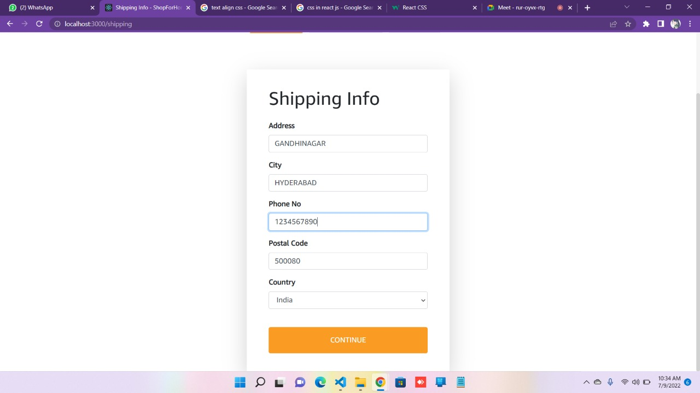
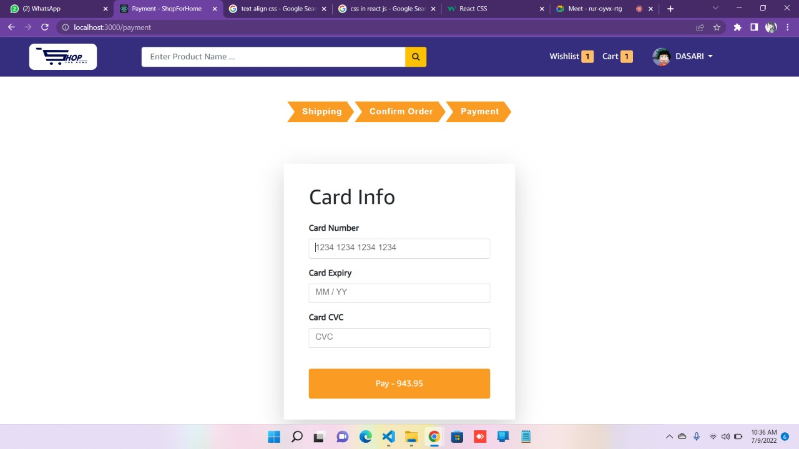
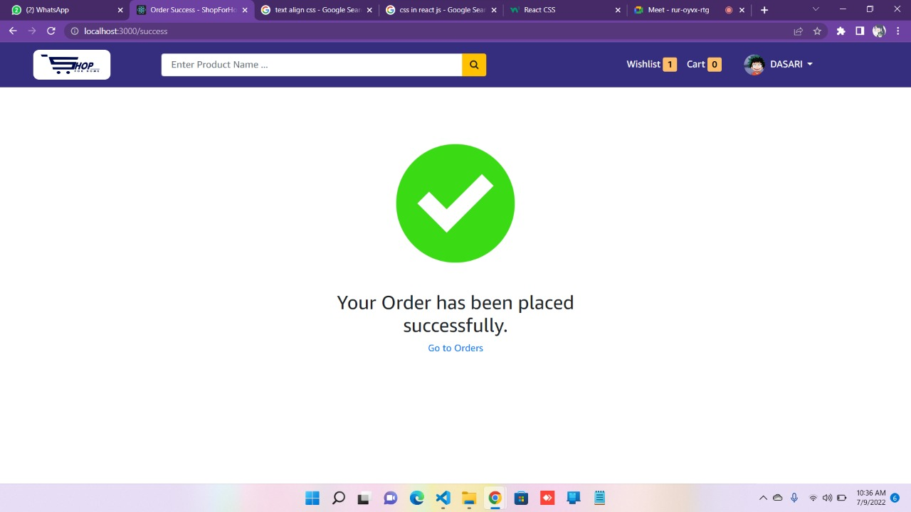


## Usage

- Create a .env file inside backend/config.

- Copy the following lines and specify appropriate values.

```
PORT = 4000
NODE_ENV = DEVELOPMENT
DB_URI = mongodb+srv://<username>:<password>@mern.apqfp.mongodb.net/<collection-name>?retryWrites=true&
JWT_SECRET =
JWT_EXPIRES_TIME = 7d
COOKIE_EXPIRES_TIME = 7

CLOUDINARY_CLOUD_NAME =
CLOUDINARY_API_KEY =
CLOUDINARY_API_SECRET =

STRIPE_SECRET_KEY =
STRIPE_API_KEY =

SMTP_HOST = smtp.gmail.com
SMTP_PORT = 587
SMTP_EMAIL =
SMTP_PASSWORD =
SMTP_FROM_EMAIL = noreply@shopforhome.com
SMTP_FROM_NAME = ShopForHome
```

Install dependencies

```bash
npm install -g yarn
npm install
cd frontend
npm install
In seprate terminal open
cd backend 
npm install
```

### Run App

For running Server

```bash
npm start
```

For running Client

```bash
npm start
```

